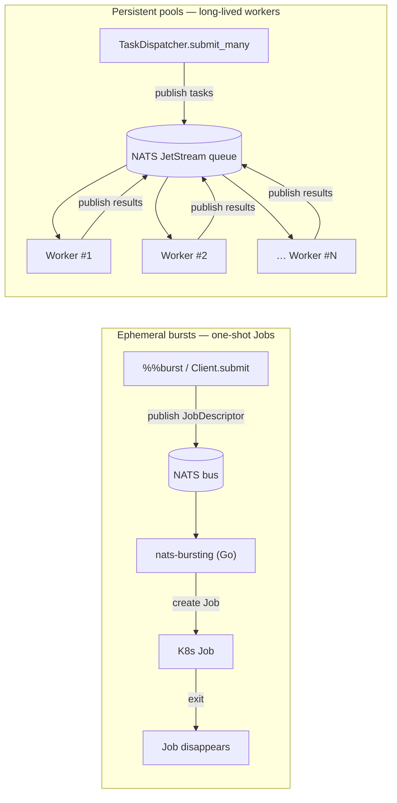
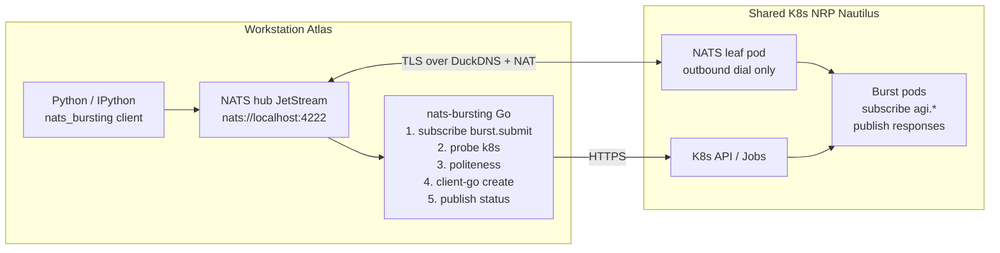
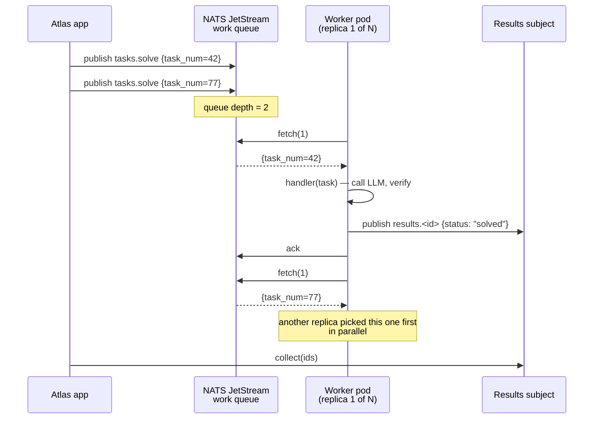
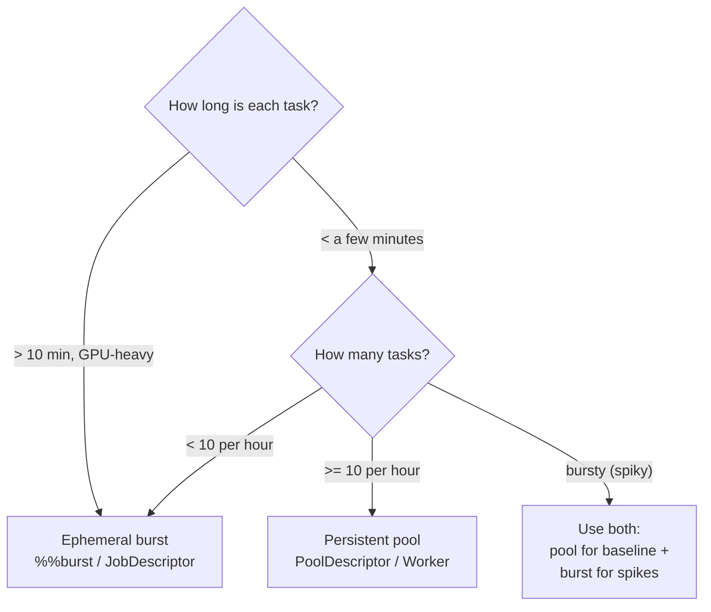

# nats-bursting

[](https://github.com/ahb-sjsu/nats-bursting/actions/workflows/ci.yml)
[](https://pypi.org/project/nats-bursting/)
[](https://goreportcard.com/report/github.com/ahb-sjsu/nats-bursting)
[](LICENSE)


**Cloud bursting for AI workloads, over a NATS bus.**

`nats-bursting` lets a single workstation treat a shared Kubernetes cluster
(e.g. NRP Nautilus) as elastic extra GPU capacity — without leaving the
familiar NATS event loop. Your cognitive workloads publish messages on a
local NATS subject; a small Go controller (or a Python worker loop)
carries them into the cluster; the pods join the same NATS fabric as
first-class subscribers and publish responses back.

## Two shapes, one bus

You can use the cluster in two complementary ways:



|                     | Ephemeral burst         | Persistent pool            |
| ------------------- | ----------------------- | -------------------------- |
| K8s object          | `Job` (one-shot)        | `Deployment` (always-on)   |
| Cold start per task | **yes** — pod boots     | **no** — worker is warm    |
| Best for            | rare, heavy, long tasks | frequent small tasks       |
| Scaling model       | one Job per task        | N replicas + backpressure  |
| Classes             | `JobDescriptor`, `Client` | `PoolDescriptor`, `Worker` |

Both shapes share the same NATS fabric, the same leaf-node
connectivity, and the same "pods are first-class subscribers" property.
Pick the one that fits your workload; use both if you want.

```python
%load_ext nats_bursting.magic

%%burst --gpu 1 --memory 24Gi
import torch
model = load_qwen_72b()      # runs on a remote GV100 in Nautilus
model.generate(prompt)        # result comes back over NATS
```

The cell runs locally if your GPU has headroom and bursts to Nautilus
when it doesn't.

## Why NATS?

Cloud-bursting tutorials usually bolt onto an HTTP job queue. If you
already run a NATS event bus for inter-service coordination, a parallel
queue is unnecessary and adds latency.

`nats-bursting` instead **extends the bus itself**. Remote pods become
first-class participants via NATS leaf-node connections — they subscribe
to the same subjects as your local services. No separate dispatcher, no
polling, no protocol translation.

Features:

- **Politeness backoff**, inspired by CSMA/CA and
  [polite-submit](https://github.com/ahb-sjsu/polite-submit). The
  controller probes your own queue depth, cluster-wide pending pods, and
  per-node utilization before each submission; backs off exponentially
  when shared thresholds are exceeded.
- **One protocol end-to-end.** `agi.memory.query.*` works the same
  whether the handler is Spock (local GPU) or a burst pod in SDSC.
- **Zero inbound ports on the workstation.** Remote pods dial outbound
  via a NATS leaf connection over DuckDNS + NAT — no Tailscale, no
  Funnel, no sidecars.
- **Cell-level bursting.** `%%burst` packages a Jupyter cell as a Job
  and ships it. Only bursts when `nvidia-smi` says the local GPU is full.

## Architecture



<details>
<summary>ASCII version</summary>

```
  Workstation ("Atlas")                             Shared K8s (e.g. NRP Nautilus)
 ┌───────────────────────┐                         ┌──────────────────────────┐
 │  Python / IPython ────┼─► nats://localhost:4222 │                          │
 │  nats_bursting client │                         │                          │
 │                       │                         │  Burst pods:             │
 │  NATS hub (JetStream) │                         │   subscribe agi.*,       │
 │         ▲             │                         │   publish responses      │
 │         │             │                         │                          │
 │         │  leaf link  │ ◄─── TLS over DuckDNS ──┤  NATS leaf pod           │
 │         │  (TLS, NAT) │      + router NAT       │  (outbound dial only)    │
 │         ▼             │                         │                          │
 │  nats-bursting (Go)   │                         │                          │
 │   1. subscribe burst.submit                     │                          │
 │   2. probe k8s state  │                         │                          │
 │   3. politeness check │                         │                          │
 │   4. client-go create ──────── HTTPS ──────────►│  K8s API / Jobs          │
 │   5. publish status   │                         │                          │
 └───────────────────────┘                         └──────────────────────────┘
```

</details>

For the full design, see [`docs/design.md`](docs/design.md). For the
leaf-node connectivity runbook, see
[`docs/nats-leafnode-duckdns.md`](docs/nats-leafnode-duckdns.md).

## Install

### Python client (from PyPI)

```bash
pip install 'nats-bursting[ipython]'
```

### Go controller (from source)

```bash
git clone https://github.com/ahb-sjsu/nats-bursting
cd nats-bursting
go build -o /usr/local/bin/nats-bursting ./cmd/nats-bursting
```

A systemd unit template is provided at
[`deploy/systemd/nats-bursting.service`](deploy/systemd/nats-bursting.service).

### Kubernetes (remote cluster)

`deploy/kubernetes/nrp/` contains a Kustomize base you can adapt to any
cluster — it installs a NATS leaf pod, a Service for in-namespace
workloads to reach it, and a ServiceAccount with the minimum RBAC the
controller uses. See the leaf-node doc for the end-to-end setup.

## Submitting a job from Python

```python
from nats_bursting import Client, JobDescriptor, Resources

client = Client(nats_url="nats://localhost:4222")

result = client.submit_and_wait(
    JobDescriptor(
        name="hello",
        image="python:3.12-slim",
        command=["python", "-c", "print('hi from the cluster')"],
        resources=Resources(cpu="100m", memory="128Mi"),
    ),
    timeout=60,
)
print(result.k8s_job_name)
```

## `%%burst` cell magic

```python
%load_ext nats_bursting.magic

%%burst --gpu 1 --memory 16Gi --image pytorch/pytorch:2.5-cuda12.4
import torch
x = torch.randn(8192, 8192, device="cuda")
print(torch.matmul(x, x).norm())
```

| Flag           | Meaning                                                  |
|----------------|----------------------------------------------------------|
| `--when-busy`  | (default) burst only if every local GPU is saturated     |
| `--always`     | burst unconditionally                                    |
| `--never`      | run locally, skip the burst machinery (handy for debug)  |
| `--gpu N`      | request `N` GPUs in the burst pod                        |
| `--cpu X`      | CPU request (`"2"`, `"500m"`)                            |
| `--memory X`   | memory request (`"16Gi"`)                                |
| `--image IMG`  | container image; default `python:3.12-slim`              |
| `--timeout S`  | submit-ack timeout in seconds                            |
| `--dry-run`    | print the JobDescriptor JSON, don't submit               |

Cell source rides in the `NATS_BURSTING_CELL` env var and runs under
`python -c "$NATS_BURSTING_CELL"` inside the pod.

## Persistent worker pools

When a workload consists of **many small tasks** rather than a few big
ones, ephemeral Jobs waste time on cold starts. A `PoolDescriptor`
describes N always-on pods pulling from a JetStream work queue — no
per-task ramp-up, full cluster-wide parallelism.

### What does a pool do?



The important properties:

- **One stream, many workers.** All N replicas share a single durable
  consumer, so every message is delivered to exactly one worker.
- **Backpressure is free.** If all workers are busy, tasks queue up in
  JetStream with at-least-once persistence. When a worker becomes free it
  pulls the next one.
- **No sleep-to-idle.** `sub.fetch(timeout)` blocks on the socket until
  a task arrives — this satisfies NRP's "Jobs may not sleep" policy
  because the pod is blocked in a receive, not in `time.sleep`.
- **Crashes heal themselves.** Unacked tasks are redelivered after
  `ack_wait`. Dead pods are respawned by the Deployment.

### Quick start

Ship a handler module + a thin entrypoint on your pod image:

```python
# my_project/worker_main.py
from nats_bursting import run_worker

def handle_solve(task: dict) -> dict:
    return {"status": "solved", "answer": task["x"] ** 2}

if __name__ == "__main__":
    run_worker(handlers={"solve": handle_solve})
```

Render the Deployment manifest from Python:

```python
from nats_bursting import PoolDescriptor, pool_manifest

yaml = pool_manifest(PoolDescriptor(
    name="square-pool",
    namespace="ssu-atlas-ai",
    replicas=8,                                  # 8 warm workers
    cpu="1", memory="2Gi",                       # stay in NRP swarm mode
    consumer_group="square-workers",
    subjects=["tasks.>"],
    pre_install=["pip install --quiet my-project"],
    entry=["python3", "-u", "-m", "my_project.worker_main"],
))
print(yaml)
# kubectl apply -f <(python -c "print(open('pool.yaml').read())")
```

Dispatch tasks and collect results from Atlas:

```python
import asyncio
from nats_bursting import TaskDispatcher

async def main():
    async with TaskDispatcher("nats://localhost:4222") as td:
        ids = await td.submit_many(
            "tasks.solve",
            [{"type": "solve", "x": i} for i in range(100)],
        )
        results = await td.collect(ids, timeout=60)
        for tid, r in results.items():
            print(tid, r)

asyncio.run(main())
```

### When to pick a pool vs. an ephemeral burst



Rough rule of thumb: if your per-task cold start (image pull, model
download, etc.) is longer than the task itself, use a pool.

### NRP-specific tuning

NRP Nautilus has two policy regimes:

- **Swarm mode** (preferred): all pods lightweight (≤ 1 CPU, ≤ 2Gi
  memory, ≤ 40% GPU). Unlimited replicas.
- **Heavy mode**: up to 4 pods at full GPU. No mixing.

Pool replicas fit cleanly in swarm mode. Keep `cpu="1"` and
`memory="2Gi"` and you can scale to dozens of replicas without running
into the heavy-pod cap. Only A100s are hard-quota-limited (request the
access form); every other GPU class (V100, L4, L40, A10, consumer
cards) is available on demand.

For GPU pool workers, add `gpu=1` to the `PoolDescriptor`; request a
specific model with a node selector if you care which card you land on.

More detail, including the full task lifecycle, ack/redelivery
semantics, and the handler contract, is in
[`docs/pools.md`](docs/pools.md).

## Politeness defaults

Tuned conservatively for shared academic clusters (NRP):

| Threshold                  | Default    | Purpose                              |
|----------------------------|------------|--------------------------------------|
| `max_concurrent_jobs`      | 10         | cap on your own running Jobs         |
| `max_pending_jobs`         | 5          | cap on your own pending Jobs         |
| `queue_depth_threshold`    | 100 pods   | cluster-wide back off trigger        |
| `utilization_threshold`    | 0.85       | node CPU pressure trigger            |
| `initial_backoff`          | 30 s       | first wait                           |
| `max_backoff`              | 15 min     | cap on exponential wait              |
| `backoff_multiplier`       | 2.0        | double each failed attempt           |
| `max_attempts`             | 15         | give up after this many cycles       |

Override via `config.yaml` (example in
[`deploy/atlas/config.yaml`](deploy/atlas/config.yaml)) or CLI flags.

## Status

End-to-end path proven: cell submission from a workstation → local NATS
→ Go controller with politeness decision → `client-go` Job creation on
NRP Nautilus → pod ran on an SDSC node → logs streamed back.

Currently alpha. Known gaps (tracked in issues):

- Status-event streaming for long-running Jobs (controller currently
  publishes the initial ack only)
- Cancellation subject (`burst.cancel.*`) not yet wired
- Per-tenant subject ACLs — single-user today

## Citation

If you use `nats-bursting` in academic work:

```bibtex
@software{bond_nats_bursting_2026,
  author = {Bond, Andrew H.},
  title  = {nats-bursting: Cloud bursting for AI workloads over a NATS bus},
  year   = {2026},
  url    = {https://github.com/ahb-sjsu/nats-bursting}
}
```

## License

MIT — see [`LICENSE`](LICENSE).
