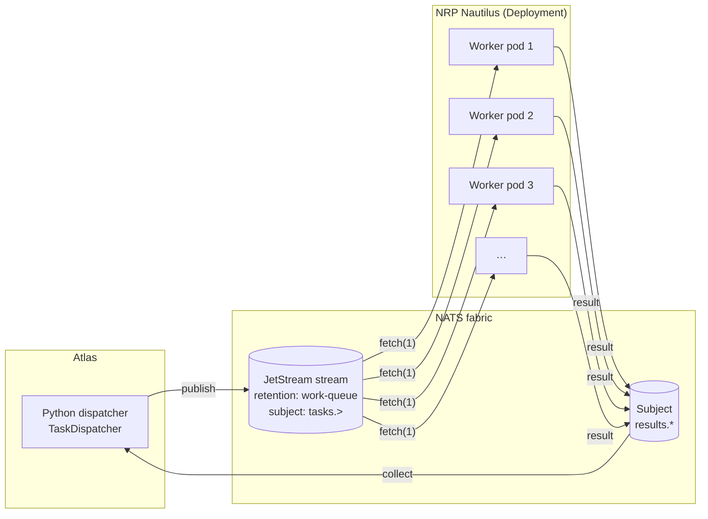
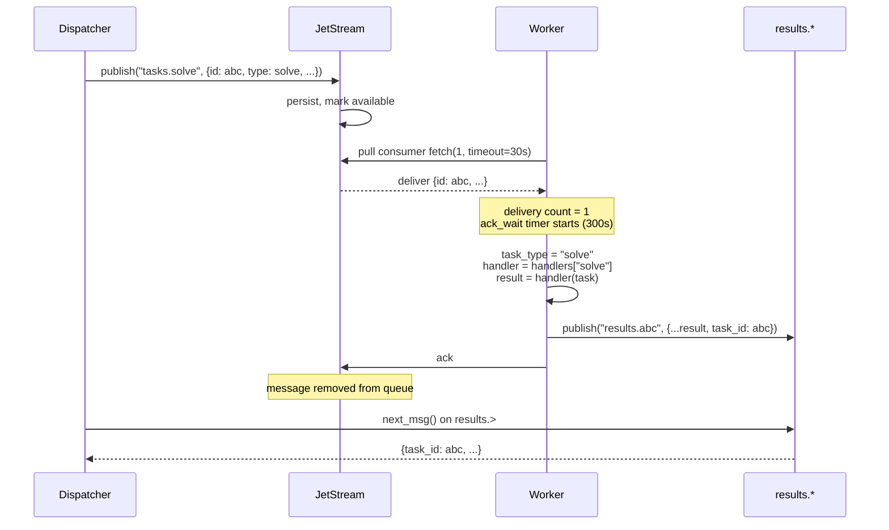
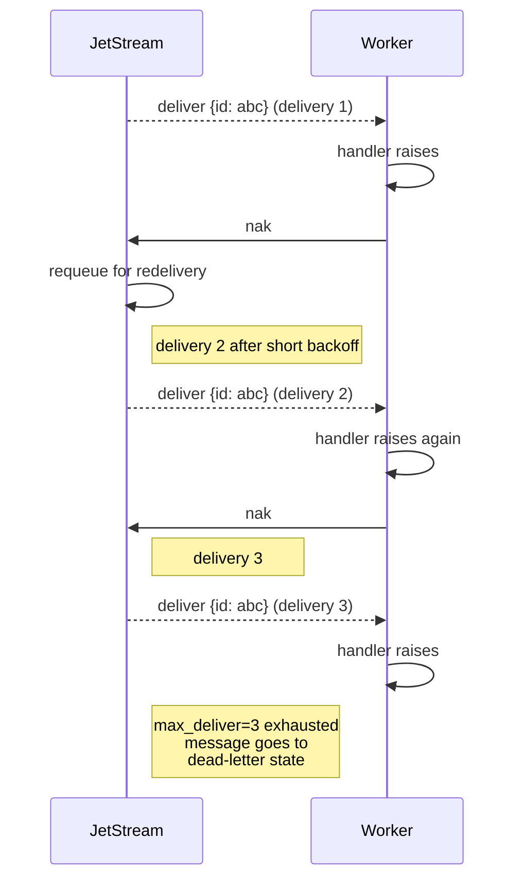
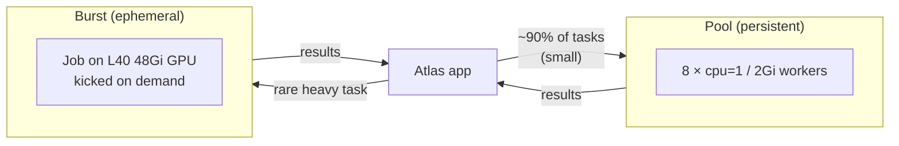

# Persistent worker pools

This is the long-form companion to the README section on pools. It
covers the lifecycle, failure modes, and operational patterns so you
can reason about what happens under the hood.

## Mental model

A pool is **N identical pods**, each running the same
`nats_bursting.Worker` loop, all subscribed to the same durable
JetStream consumer. You publish task messages; JetStream holds them
and delivers each to exactly one of the workers.



Key property of a **work-queue** stream: each message is retained only
until *some* subscriber acks it. That's different from the default
limits/interest streams — it guarantees exactly one worker processes
each task (barring crashes; see below).

## Task lifecycle



### On handler exception



If a task genuinely can't be processed (bad input, bug), the worker
catches the exception and publishes an error result so the dispatcher
is never left hanging. The task is also **nak**'d — JetStream redelivers
it up to `max_deliver` times (default 3) in case the failure was
transient. After that it's held in a dead-letter state you can inspect
via `nats stream view`.

### On ack-wait timeout (worker crash mid-task)

If a worker pulls a task and then crashes before acking, JetStream
redelivers the task to another worker after `ack_wait_s` seconds
(default 300). This makes the system self-healing: an OOM-kill or
network blip doesn't lose work.

## The handler contract

A handler is any callable that takes the task dict and returns a dict:

```python
TaskHandler = Callable[[dict], dict]
```

- Sync and async handlers are both supported — if the return value is
  a coroutine, the worker awaits it.
- The return dict is published as-is to `results.<task_id>`.
- The worker adds a few metadata keys on top of your return value
  (`task_id`, `worker`, `ts`, `duration_s`), so don't overwrite those.
- Raise any exception you like — it becomes `{"error": str(e), "traceback": "..."}`
  in the result.

## Config knobs

All via env vars so they match the `Worker` dataclass defaults and
can be overridden from the `PoolDescriptor`:

| Env var                 | Default                       | Purpose                                    |
| ----------------------- | ----------------------------- | ------------------------------------------ |
| `NATS_URL`              | `nats://atlas-nats:4222`      | in-cluster leaf service (set automatically) |
| `NATS_STREAM`           | `TASKS`                       | JetStream stream name                      |
| `NATS_SUBJECTS`         | `tasks.>`                     | comma-separated subject filter             |
| `NATS_CONSUMER_GROUP`   | `workers`                     | durable consumer name prefix               |
| `NATS_RESULT_PREFIX`    | `results.`                    | subject prefix for results                 |
| `NATS_WORKER_HANDLERS`  | (unset → echo worker)         | dotted path to a `handlers` dict           |

## Sizing a pool

Assume each task takes `T` seconds and you want to process `R`
tasks/second steady-state. You need `N >= R * T` warm workers. Add
some slack for variance.

Examples:
 - 200 tasks/minute, each task 10s → N = 200/60 * 10 ≈ 34 workers.
 - 1 task every 2 minutes, each task 30s → N = 1 is fine; this is
   actually a case for ephemeral bursts.

## Scaling up and down

A `Deployment` supports `kubectl scale`:

```bash
kubectl -n ssu-atlas-ai scale deployment/my-pool --replicas=32
```

Scaling up is instant — new pods attach to the consumer and start
pulling. Scaling down is clean because the work-queue retention means
the remaining pods pick up whatever the terminated ones were about to
fetch (nothing is stranded).

You can also pause processing without tearing down pods by pausing the
stream: `nats stream pause TASKS`.

## Mixing pools and ephemeral bursts

Nothing stops you from running a steady-state pool for your common
work and occasionally firing `%%burst`-style one-shot Jobs for the
unusually-large tasks. Both shapes share the same NATS bus — use the
same subscriber to consume both types of results.

A typical split:



## Security note

Both the leaf connection and the in-cluster service use credentials
already configured for `nats-bursting`. Worker pods read
`NRP_LLM_TOKEN` (or any other secret) from Kubernetes secrets — don't
bake tokens into the image.
